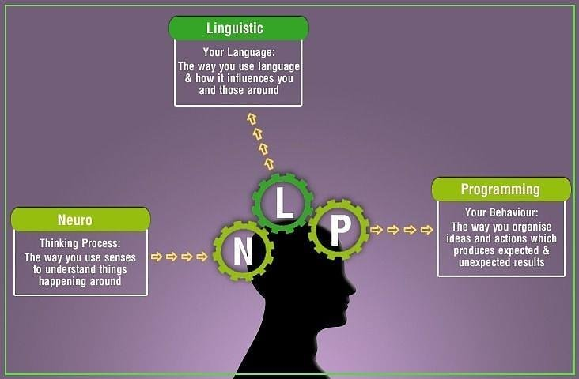

% Idris for Haskell developers
% Kostiantyn Rybnikov
% April 22, 2018

# Intro

# Why another language? Fewer bugs in Haskell code?

---


## Linear Types in Haskell

> The result won't be as good as Rust for what Rust does: it's a different trade-off where we assume that such precision is only needed in small key areas of a program that otherwise freely uses functional programming abstractions as we know them today.

---

## Linear Types in Haskell


## Linear Types in Haskell

```haskell
split :: [a] ->. ([a], [a])
split []      = ([], [])
split [x]     = ([x], [])
split (x:y:z) = go (x,y) (split z) where
  go :: (a,a) ->. ([a], [a]) ->. ([a], [a])
  go (a,b) (c,d) = (a:c, b:d)
```

---


---


## Logic


---

```idris
postulate N : Type
postulate lt : N -> N -> Type
postulate gt : N -> N -> Type
postulate add : N -> N -> N

postulate axiom1 : (x, y : N)
  -> Either (x = y) $ Either (x `lt` y) (x `gt` y)
postulate axiom2 : x `lt` y -> Not (y `lt` x)
postulate axiom3 : x `gt` y -> Not (y `gt` x)
postulate axiom4 : x `lt` y -> y `lt` z -> x `lt` z
postulate axiom5 : x `gt` y -> y `gt` z -> x `gt` z

theorem1 : Not (x `lt` x)
theorem1 contra = axiom2 contra contra
```

# NLP

---



---


---


---


---


---


---


---

```haskell
-- | Pr(c|t_i). Main working horse.
multinomialNaiveBayes ::
     (Eq word, Eq cls, Hashable cls) =>
     Env cls word -> [word] -> cls
multinomialNaiveBayes env wrds = getMax (map f (envClasses env))
  where
    d = Document (error "classes not known yet") wrds
    f c =
      ( c
      , classPrior env c * (documentProbability env d c) /
        normalizationFactor env d)
getMax = fst . head . sortBy (flip compare `on` snd)
```

---

```haskell
-- | Globals used in formulas
data Env cls word = Env
  { envClasses :: [cls]
  , envDocs :: [Document cls word]
  , envVocabulary :: [word]
  , envEfficiencyCache :: EfficiencyCache cls word
    -- ^ added purely for lookup efficiency
  } deriving (Show, Eq, Generic)
```

---

```haskell
docsInClass ::
     (Eq cls, Hashable cls) =>
     Env cls word -> cls -> [Document cls word]
docsInClass env c =
  fromMaybe []
    (H.lookup c (docsPerClass (envEfficiencyCache env)))
  where
_noCacheImp = filter (\d -> c `elem` docClasses d) (envDocs env)
```

# Math Institute

---


---


---


# The Talk

---

```idris
StringOrInt : Bool -> Type
StringOrInt x = case x of
  True => Int
  False => String
```

---

```idris
StringOrInt : Bool -> Type
StringOrInt x = case x of
  True => Int
  False => String

getStringOrInt : (x : Bool) -> StringOrInt x
getStringOrInt x = case x of
  True => 94
  False => "Ninety four"

valToString : (x : Bool) -> StringOrInt x -> String
valToString x val = case x of
  True => cast val
  False => val
```

# Smaller things

## Colors in the REPL


## Colors in the REPL


## Definition ordering matters

```idris
mutual
  even : Nat -> Bool
  even Z = True
  even (S k) = odd k

  odd : Nat -> Bool
  odd Z = False
  odd (S k) = even k
```

## Documentation comments

```idris
Idris> :doc List
Data type Prelude.List.List : Type -> Type
Generic lists
Constructors:
Nil : List elem
The empty list
(::) : elem -> List elem -> List elem
A non-empty list, consisting of a head element and the rest of
the list.
infixr 7
```

## Pattern-matching with alternatives:

```idris
readNumbers : IO (Maybe (Nat, Nat))
readNumbers =
  do Just num1_ok <- readNumber | Nothing => pure Nothing
     Just num2_ok <- readNumber | Nothing => pure Nothing
     pure (Just (num1_ok, num2_ok))
```

## Lighter update syntax

```idris
update_billing_address : Customer -> String -> Customer
update_billing_address customer address =
  record { account->address = address } customer
```

## Apply function over a field

```idris
concat_billing_address : Customer -> String -> Customer
concat_billing_address customer complement =
  record { account->address $= (++ complement) } customer
```

## Lossy Cast instead of Read

```idris
Idris> :doc Cast
Interface Cast
    Interface for transforming an instance of a data type to another type.

Parameters:
    from, to

Methods:
    cast : Cast from to => (orig : from) -> to

the Int (cast "abc")
=> 0 : Int

the Int (cast "123")
=> 123 : Int
```

## Records and projections have only one constructor

```haskell
data Foo = Foo { getFoo :: Int }
         | Bar { getBar :: Int }

getFoo (Bar 10)  -- BOOM!
```

---

- strings are not lists
- the %name directive lets you choose which names are generated upon code-generation
- shared base editor integration
- etc.?

# Bigger things

---

## Can't type-check this without a type-hint

```idris
import Data.Vect

total insSortKr : Ord elem => Vect n elem -> Vect n elem
insSortKr [] = []
insSortKr (x :: []) = [x]
insSortKr (x :: xs) = insertKr x (insSortKr xs)
  where
    -- insertKr : elem -> Vect n elem -> Vect (S n) elem
    insertKr el [] = [el]
    insertKr el (y :: ys) =
      case el > y of
        False => el :: y :: ys
        True => y :: (insertKr el ys)
```

## Can't type-check this without a type-hint

```
- + Errors (1)
 `-- no_typehint_check.idr line 9 col 4:
     When checking left hand side of Main.insSortKr, insertKr:
     Type mismatch between
             Vect 0 elem (Type of [])
     and
             Vect len elem (Expected type)
     
     Specifically:
             Type mismatch between
                     0
             and
                     len
```

## Type-hints via "the"

```idris
Idris> :doc the
Prelude.Basics.the : (a : Type) -> (value : a) -> a
    Manually assign a type to an expression.
    Arguments:
        a : Type  -- the type to assign
        
        value : a  -- the element to get the type
        
    The function is Total
Idris> the Int (cast "20")
20 : Int
```

## Bound and unbound implicits

```idris
reverse : List elem -> List elem
append : Vect n elem -> Vect m elem -> Vect (n + m) elem

reverse : {elem : Type} -> List elem -> List elem
append : {elem : Type} -> {n : Nat} -> {m : Nat} ->
         Vect n elem -> Vect m elem -> Vect (n + m) elem

-- while internally it's:
append : {elem : _} -> {n : _} -> {m : _} ->
         Vect n elem -> Vect m elem -> Vect (n + m) elem
-- and inferred as:
append : {elem : Type} -> {n : Nat} -> {m : Nat} ->
         Vect n elem -> Vect m elem -> Vect (n + m) elem
```

## Overloading names

```idris
Idris> the (List _) ["Hello", "There"]
["Hello", "There"] : List String
Idris> the (Vect _ _) ["Hello", "There"]
["Hello", "There"] : Vect 2 String
```

## Record fields are namespaced

```idris
record Account where
  constructor MkAccount
  accound_id : String
  address : String

record Customer where
  constructor MkCustomer
  name : String
  address : String
  account : Account

custom_billing_account : Customer -> Bool
custom_billing_account customer =
  address customer /= address (account customer)
```

## Separation of evaluation and execution

```idris
double_it : IO ()
double_it = do
  input <- getLine
  let n = the Int (cast input)
  printLn (n * 2)
```

## Separation of evaluation and execution

```idris
[*src/InOut> double_it
io_bind (io_bind prim_read
                 (\x =>
                    io_pure (prim__strRev (with block in Prelude.Interactive.getLine', trimNL (MkFFI C_Types String String)
                                                                                              (prim__strRev x)
                                                                                              (with block in Prelude.Strings.strM (prim__strRev x)
                                                                                                                                  (Decidable.Equality.Bool implementation of Decidable.Equality.DecEq, method decEq (not (intToBool (prim__eqString (prim__strRev x)
                                                                                                                                                                                                                                                    "")))
                                                                                                                                                                                                                    True))))))
        (\input =>
           io_bind (prim_write (prim__concat (prim__toStrInt (prim__mulInt (prim__fromStrInt input) 2)) "\n"))
                   (\__bindx => io_pure ())) : IO ()
```

## Separation of evaluation and execution

```idris
[*src/InOut> :exec double_it
123 -- My input
246 -- Output
```

## Using implicit arguments in functions

```idris
-- instead of
length : Vect n elem -> Nat
length [] = Z
length (x :: xs) = 1 + length xs

-- you can do when you need to:
length : Vect n elem -> Nat
length {n} xs = n
```

## Holes are OK to leave upon evaluation

```idris
allLengths : List String -> List Nat
allLengths [] = []
allLengths (word :: words) = length word :: ?rest

*WordLength> allLengths ["Hello", "Interactive", "Editors"]
5 :: ?rest : List Nat
```

## Do notation without Monads

```idris
namespace CommandDo
  (>>=) : Command a -> (a -> Command b) -> Command b
  (>>=) = Bind
namespace ConsoleDo
  (>>=) : Command a -> (a -> Inf (ConsoleIO b)) -> ConsoleIO b
  (>>=) = Do
```

## Laziness is opt-in, not opt-out

TODO

## Type synonyms are just a special case of function application

```idris
import Data.Vect
Position : Type
Position = (Double, Double)

Polygon : Nat -> Type
Polygon n = Vect n Position

tri : Polygon 3
tri = [(0.0, 0.0), (3.0, 0.0), (0.0, 4.0)]
```

# Big things

## Totality checking

TODO

## Implicit values

```idris
λΠ> :doc append
Main.append : (elem : Type) ->
    (n : Nat) -> (m : Nat) -> Vect n elem -> Vect m elem -> Vect (n + m) elem
*Append> append _ _ _ ['a','b'] ['c','d']
['a', 'b', 'c', 'd'] : Vect 4 Char
*Append> append _ _ _ _ ['c','d']
(input):Can't infer argument n to append,
Can't infer explicit argument to append
```

## Dependent tuples

```idris
readVect : IO (len ** Vect len String)
readVect = do x <- getLine
              if (x == "")
              then pure (_ ** [])
              else do (_ ** xs) <- readVect
                      pure (_ ** x :: xs)
```

## ViewPatterns

> Haskell in 1987, in his paper “Views: a way for pattern matching to cohabit with data abstraction.”

> Views as a programming idiom, using dependent types and a notation similar to the with notation in Idris, was later proposed by Conor McBride and James McKinna in their 2004 paper, “The view from the left.”

## Using views to eliminate the division by zero problem

```idris
import Data.Primitives.Views

arithInputs : Int -> Stream Int
arithInputs seed = map bound (randoms seed)
  where
    bound : Int -> Int
    bound num with (divides num 12)
      bound ((12 * div) + rem) | (DivBy prf) = rem + 1
```

## Using views to eliminate the division by zero problem

```idris
λΠ> :doc divides
Data.Primitives.Views.Int.divides : (val : Int) -> (d : Int) -> Divides val d
    Covering function for the Divides view
    
    The function is Total
λΠ> :doc Divides
Data type Data.Primitives.Views.Int.Divides : Int -> (d : Int) -> Type
    View for expressing a number as a multiplication + a remainder
    
Constructors:
    DivByZero : Divides x (fromInteger 0)
        
        
    DivBy : (prf : rem >= fromInteger 0 && Delay (rem < d) = True) ->
        Divides (d * div + rem) d
```

# Demo

# Outro

## Good news

```haskell
item :: pi (b :: Bool) -> Cond b Int [Int]
item True  = 42
item False = [1,2,3]
```

## Acknowledgements and links

- Edwin Brady, for the book and the language
- https://deque.blog/2017/06/14/10-things-idris-improved-over-haskell/
- ​https://www.tweag.io/posts/2017-03-13-linear-types.html
- https://github.com/k-bx/nlp/blob/master/naiveml/src/NaiveML/MultinomialNaiveBayes.hs
- https://stackoverflow.com/questions/37362342/difference-between-haskell-and-idris-reflection-of-runtime-compiletime-in-the-t

## KyivHaskell and Haskell Study Group


---

> After reading this book, TDD took on a new meaning for me

– Giovanni Ruggiero, Eligotech
